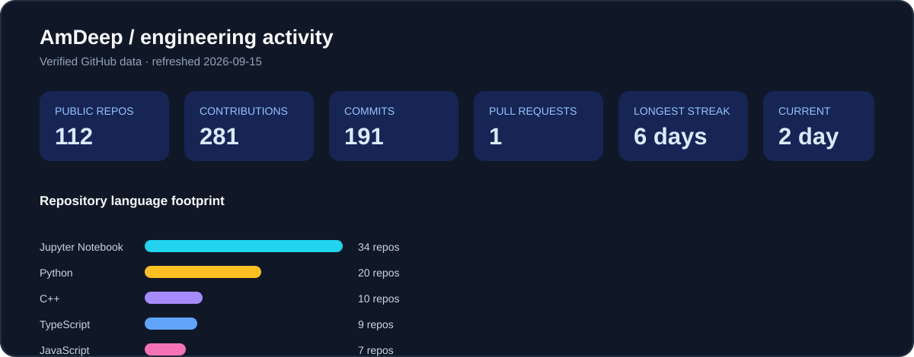

# Amardeep Singh · AmDeep

### ML/AI Engineer building systems that move from model output to useful action

Toronto, Canada · AI systems · physical AI · embedded robotics · full-stack delivery

> I design end-to-end intelligent products: data contracts, inference, agent workflows, interfaces, deployment, and the engineering controls that make automated decisions inspectable.

## What I build

| Area | Evidence in the portfolio |
| --- | --- |
| **Physical AI & robotics** | ROS 2 control boundaries, Jetson/Isaac ROS contracts, IMU pipelines, manipulation safety gates, fleet telemetry |
| **Applied AI systems** | vLLM-compatible planners, grounded operator copilots, computer vision workflows, model-serving boundaries |
| **Production-minded ML** | Replayable inputs, typed schemas, CPU/GPU fallback, safety validation, Prometheus metrics, automated tests |
| **Product engineering** | Python services, React/TypeScript experience, APIs, cloud workflows, documentation, and recruiter-readable demos |

## Live profile dashboard

<!-- PROFILE-METRICS-START -->

**Current verified snapshot:** 112 owned public repositories · 276 contributions · 186 commit contributions · 1 pull request contribution · 1-day current streak · 4-day longest streak. The scheduled workflow also records authored pull requests and GitHub code-frequency line additions/deletions when those repository statistics are available.
<!-- PROFILE-METRICS-END -->

The dashboard is generated from GitHub data by [`.github/workflows/auto-update-metrics.yml`](.github/workflows/auto-update-metrics.yml). It avoids relying on third-party stats-card services that can fail to render or expose misleading private-repository claims.

## Featured systems

### Physical AI and robotics

- [ROS 2 vLLM Navigation Bridge](https://github.com/AmDeep/ros2-vllm-navigation-bridge) · bounded `cmd_vel`, Isaac ROS topic contracts, odometry replay, and local obstacle stopping.
- [Manipulation vLLM Safety Gateway](https://github.com/AmDeep/manipulation-vllm-safety-gateway) · joint-limit validation, trajectory generation, dry-run approval, and Isaac Sim-compatible export.
- [Edge IMU Anomaly Detector](https://github.com/AmDeep/edge-imu-anomaly) · real CSV sensor contracts, windowed features, deterministic scoring, and ONNX Runtime/CUDA capability detection.
- [Fleet Telemetry + vLLM Operations](https://github.com/AmDeep/fleet-telemetry-vllm-ops) · MQTT-shaped telemetry, Jetson `tegrastats` parsing, Prometheus metrics, and grounded incident prompts.

### Inference and vision

- [Edge Vision vLLM Inspector](https://github.com/AmDeep/edge-vision-vllm-inspector) · OpenCV image boundaries, Triton HTTP v2 request construction, TensorRT engine inspection, and safety-gated semantic results.
- [AESIR](https://github.com/AmDeep/AESIR) · full-stack AI agent platform.
- [AI_Chatbot](https://github.com/AmDeep/AI_Chatbot) · conversational AI application work.
- [Face-Track-Detect-Extract](https://github.com/AmDeep/Face-Track-Detect-Extract) · computer vision and multi-target tracking.

### ML, data, and control

- [Air_Quality_Predictor](https://github.com/AmDeep/Air_Quality_Predictor) · predictive modeling and environmental data.
- [Biofuel_Yield_Prediction](https://github.com/AmDeep/Biofuel_Yield_Prediction) · fuzzy logic and optimization.
- [Advanced-Process-Control-Project](https://github.com/AmDeep/Advanced-Process-Control-Project) · process control and MATLAB systems work.

## Technology map

**Languages:** Python · C/C++ · TypeScript/JavaScript · SQL · R · MATLAB
**AI/ML:** PyTorch · TensorFlow · scikit-learn · LangChain · LangGraph · vLLM
**Robotics/edge:** ROS 2 · Isaac ROS boundaries · Jetson telemetry · TensorRT/Triton contracts · ONNX Runtime · OpenCV · MQTT
**Delivery:** GitHub Actions · Docker · Azure · AWS · Prometheus-style observability · replayable test fixtures

## Engineering principles

- **Models propose; deterministic systems authorize.** Safety gates own limits, workspace checks, and actuator permissions.
- **Every demo has an input contract and an output.** Replay fixtures are explicit, and missing hardware/services produce unavailable states instead of fabricated results.
- **Edge and cloud are complementary.** Perception and control can stay local while vLLM/Triton provide optional semantic or high-throughput inference services.
- **Performance claims require the target runtime.** Jetson, CUDA, TensorRT, Triton, and Isaac ROS paths are documented as deployment paths unless the hardware is actually present.

## Activity and collaboration

- 141 public repositories listed on the GitHub account; the dashboard counts 112 owned, non-fork repositories.
- 15 followers and an active body of AI, data, systems, and robotics work.
- Interested in ML/AI engineering, agentic systems, forward-deployed engineering, robotics, edge inference, and developer-facing AI products.

## Connect

- Portfolio: [AmDeep.github.io](https://github.com/AmDeep/AmDeep.github.io)
- GitHub: [github.com/AmDeep](https://github.com/AmDeep)
- Company/community: [Omdena](https://www.omdena.com/)
